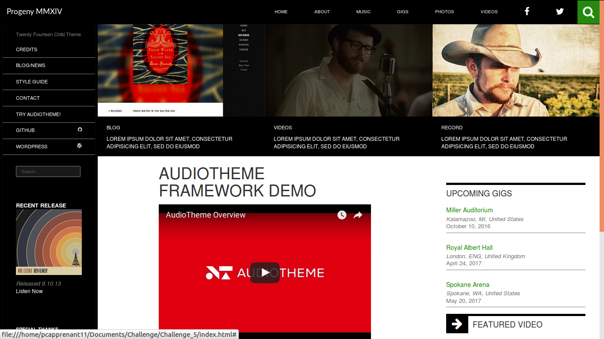

#Projet par Lise et Annie-Line

###Annie-Line

* Nav secondaire avec son contenu. Grande div noire sur le côté.
* Partie blanche contenant la video.
* Responsive intérieur de ses deux parties.
* Hover sur les images, soit les hovers avec striures sur images.

###Lise

* Nav principale avec les hovers vert + bouton de loupe de recherche.
* Mise en place de la font-icône avec l'aide d'Ange.
* Structure globale du site avec son responsive.
* Système de push et pull en boostrapt, inversion des deux parties.
* Images et leurs légendes.
* Mise en place de l'image striée avec un système d'invisible et de hidden, l'image uniquement là en MD.
* Section blanche contenant des informations sans la video.
* Création du Markdown.
* Mise en place du footer.

---

> Bon courage pour la correction =D